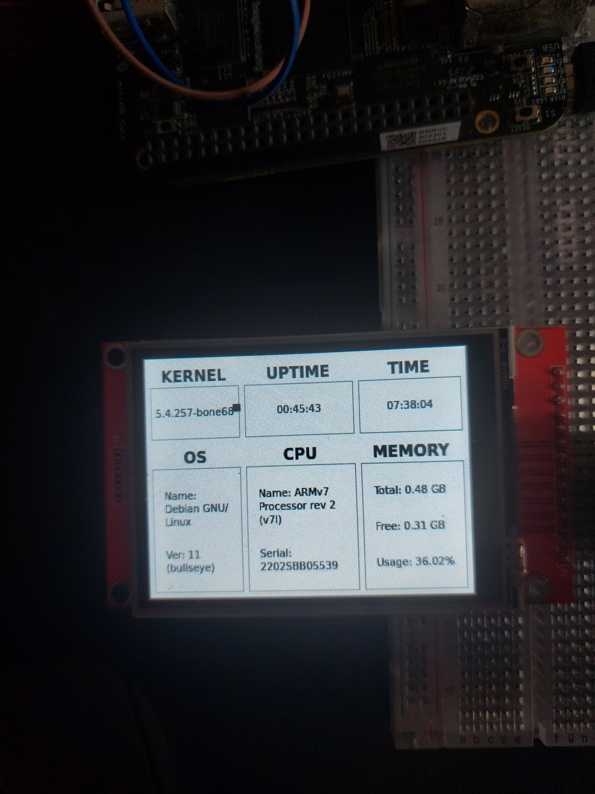

# Linux System Information Display Project

## Project Description

This project utilizes a BeagleBone Black (BBB) to interface with an ILI9341 LCD for displaying real-time Linux system information, including CPU usage, memory statistics, and operating system details. The application interface is developed using Qt/QML. 
## Main Components

- **BeagleBone Black:** A powerful embedded computer using an ARM Cortex-A8.
- **ILI9341 Display:** A compact TFT LCD screen, ideal for embedded projects.
- **Qt QML:** A powerful framework for creating dynamic and interactive graphical user interfaces, used for designing the user interface.
- **C++:** A powerful programming language used for backend processing and interfacing with hardware.

## System Requirements

- BeagleBone Black with Debian or a similar Linux distribution.
- ILI9341 display and necessary connections (SPI).
- Qt 5.x and Qt QML packages installed on the BeagleBone Black.

## Result

This image showcases the Linux system information displayed on the ILI9341 display using Qt QML.

